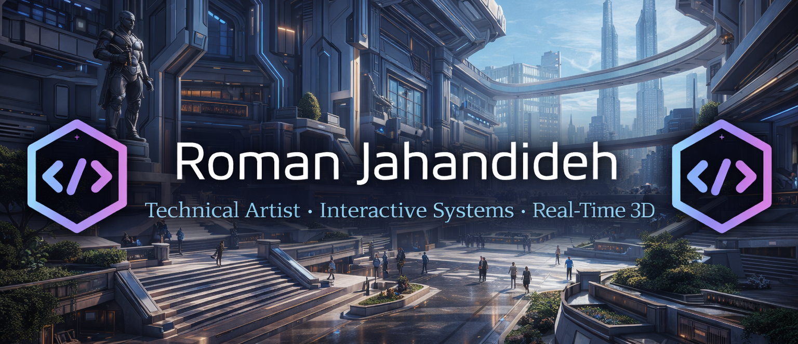

# Roman Jahandideh

Technical Artist with a background in architecture who enjoys building digital worlds instead of buildings. I work with Unity and creative technologies to design interactive environments, prototype immersive experiences, and explore ideas in real-time 3D and spatial computing.

My work focuses on combining **design, technology, and storytelling** to create engaging interactive systems and experimental environments.

Explore more of my work on my portfolio:  
https://romanjahandideh.com

## Socials

[Behance](https://www.behance.net/Romman)  
[Instagram](https://www.instagram.com/roman_jahandideh/)  
[LinkedIn](https://linkedin.com/in/roman-jahandideh-38b207351)  
[Email](mailto:Jahandidehroman@gmail.com)

## Tools & Technologies

Unity • Unreal Engine • Blender • Rhino • SketchUp  
Python • JavaScript • C# • Three.js • WebGL  
HTML • CSS • Tailwind • Bootstrap  
Figma • Framer • Adobe Illustrator
