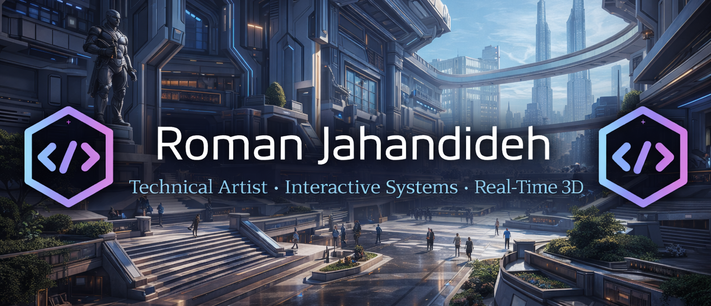

# Roman Jahandideh

**Computational Designer and HCI Researcher**

I combine architecture, landscape architecture, and interactive technology to develop human-centred digital environments and research prototypes.

My current research explores bioadaptive environments, physiological computing, embodied data, and interactive 3D systems. I use Unity, C#, JavaScript, Three.js, and WebGL to translate complex information into accessible spatial and visual experiences.

I am particularly interested in human–AI collaboration, computational design, and interactive tools that help designers and communities understand urban environments, spatial data, design constraints, and AI-generated proposals.

## Research Interests

- Human–AI co-design
- Computational design and urban visualization
- Human–computer interaction
- Interactive 3D systems and spatial computing
- Bioadaptive environments and physiological computing
- XR, serious games, and embodied interaction
- User research and human-centred evaluation

## Featured Research and Projects

### BioTerrarium

A heart-rate-driven biofeedback environment developed in Unity. The project investigates how physiological signals can influence the visual and environmental dynamics of an interactive game world.

[View repository](https://github.com/RomanJahandideh/BioTerrarium)

### Reading a Remote Teammate’s Body

An HCI research project investigating the visual communication of a remote teammate’s heart rate and heart-rate variability through animated icons.

[View repository](https://github.com/RomanJahandideh/reading-a-remote-teammates-body)

### HR–HRV Experiment System

A web-based research platform designed for validating animated physiological-data representations and collecting participant responses.

[View repository](https://github.com/RomanJahandideh/HR-HRV-experiment-design-and-data-collection-system)  
[View research website](https://biofeedbackexperiment.netlify.app/)

## Portfolio

Explore my interactive systems, architectural work, game-design projects, UI/UX studies, and 3D environments:

[romanjahandideh.com](https://romanjahandideh.com)

## Connect

## Core Technologies

### Interactive Systems and Programming

### Web-Based 3D and Interfaces

### Spatial Design and Visualization

### Design and Research Communication

